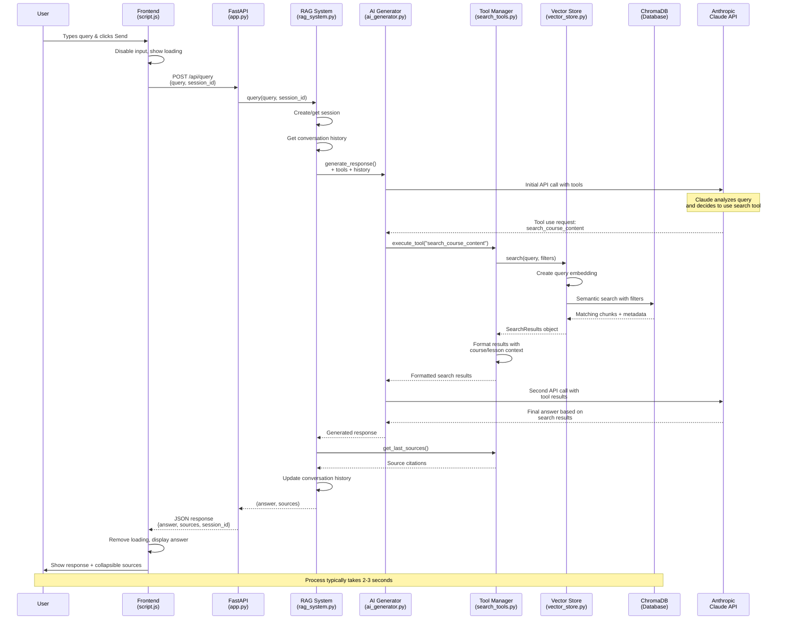
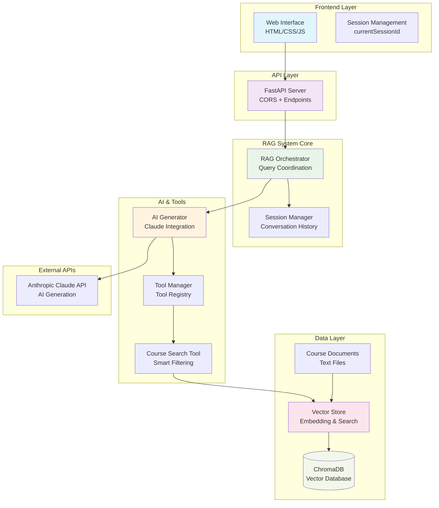
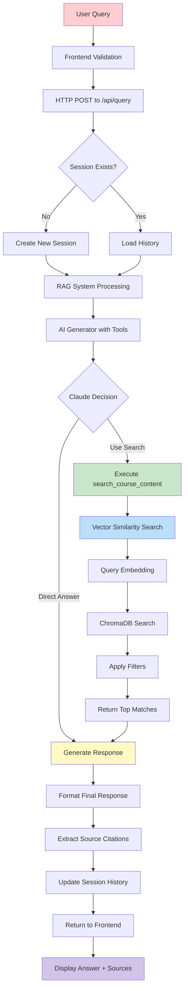

# Query Processing Flow Diagram

```mermaid
sequenceDiagram
    participant User
    participant Frontend as Frontend<br/>(script.js)
    participant FastAPI as FastAPI<br/>(app.py)
    participant RAG as RAG System<br/>(rag_system.py)
    participant AI as AI Generator<br/>(ai_generator.py)
    participant Tools as Tool Manager<br/>(search_tools.py)
    participant Vector as Vector Store<br/>(vector_store.py)
    participant ChromaDB as ChromaDB<br/>(Database)
    participant Claude as Anthropic<br/>Claude API

    User->>Frontend: Types query & clicks Send
    Frontend->>Frontend: Disable input, show loading
    Frontend->>FastAPI: POST /api/query<br/>{query, session_id}

    FastAPI->>RAG: query(query, session_id)
    RAG->>RAG: Create/get session
    RAG->>RAG: Get conversation history
    
    RAG->>AI: generate_response()<br/>+ tools + history
    AI->>Claude: Initial API call with tools
    
    Note over Claude: Claude analyzes query<br/>and decides to use search tool
    
    Claude-->>AI: Tool use request:<br/>search_course_content
    AI->>Tools: execute_tool("search_course_content")
    
    Tools->>Vector: search(query, filters)
    Vector->>Vector: Create query embedding
    Vector->>ChromaDB: Semantic search with filters
    ChromaDB-->>Vector: Matching chunks + metadata
    Vector-->>Tools: SearchResults object
    
    Tools->>Tools: Format results with<br/>course/lesson context
    Tools-->>AI: Formatted search results
    
    AI->>Claude: Second API call with<br/>tool results
    Claude-->>AI: Final answer based on<br/>search results
    
    AI-->>RAG: Generated response
    RAG->>Tools: get_last_sources()
    Tools-->>RAG: Source citations
    RAG->>RAG: Update conversation history
    RAG-->>FastAPI: (answer, sources)
    
    FastAPI-->>Frontend: JSON response<br/>{answer, sources, session_id}
    Frontend->>Frontend: Remove loading, display answer
    Frontend->>User: Show response + collapsible sources

    Note over User,ChromaDB: Process typically takes 2-3 seconds
```

## Architecture Overview

```mermaid
graph TB
    subgraph "Frontend Layer"
        UI[Web Interface<br/>HTML/CSS/JS]
        Session[Session Management<br/>currentSessionId]
    end
    
    subgraph "API Layer"
        FastAPI[FastAPI Server<br/>CORS + Endpoints]
    end
    
    subgraph "RAG System Core"
        RAG[RAG Orchestrator<br/>Query Coordination]
        SessionMgr[Session Manager<br/>Conversation History]
    end
    
    subgraph "AI & Tools"
        AI[AI Generator<br/>Claude Integration]
        ToolMgr[Tool Manager<br/>Tool Registry]
        SearchTool[Course Search Tool<br/>Smart Filtering]
    end
    
    subgraph "Data Layer"
        VectorStore[Vector Store<br/>Embedding & Search]
        ChromaDB[(ChromaDB<br/>Vector Database)]
        Docs[Course Documents<br/>Text Files]
    end
    
    subgraph "External APIs"
        Claude[Anthropic Claude API<br/>AI Generation]
    end

    UI --> FastAPI
    FastAPI --> RAG
    RAG --> SessionMgr
    RAG --> AI
    AI --> Claude
    AI --> ToolMgr
    ToolMgr --> SearchTool
    SearchTool --> VectorStore
    VectorStore --> ChromaDB
    Docs --> VectorStore
    
    style UI fill:#e1f5fe
    style FastAPI fill:#f3e5f5
    style RAG fill:#e8f5e8
    style AI fill:#fff3e0
    style VectorStore fill:#fce4ec
    style ChromaDB fill:#f1f8e9
```

## Data Flow Stages

```mermaid
flowchart TD
    A[User Query] --> B[Frontend Validation]
    B --> C[HTTP POST to /api/query]
    C --> D{Session Exists?}
    D -->|No| E[Create New Session]
    D -->|Yes| F[Load History]
    E --> G[RAG System Processing]
    F --> G
    
    G --> H[AI Generator with Tools]
    H --> I{Claude Decision}
    I -->|Use Search| J[Execute search_course_content]
    I -->|Direct Answer| L[Generate Response]
    
    J --> K[Vector Similarity Search]
    K --> K1[Query Embedding]
    K1 --> K2[ChromaDB Search]
    K2 --> K3[Apply Filters]
    K3 --> K4[Return Top Matches]
    K4 --> L
    
    L --> M[Format Final Response]
    M --> N[Extract Source Citations]
    N --> O[Update Session History]
    O --> P[Return to Frontend]
    P --> Q[Display Answer + Sources]
    
    style A fill:#ffcdd2
    style J fill:#c8e6c9
    style K fill:#bbdefb
    style L fill:#fff9c4
    style Q fill:#d1c4e9
```